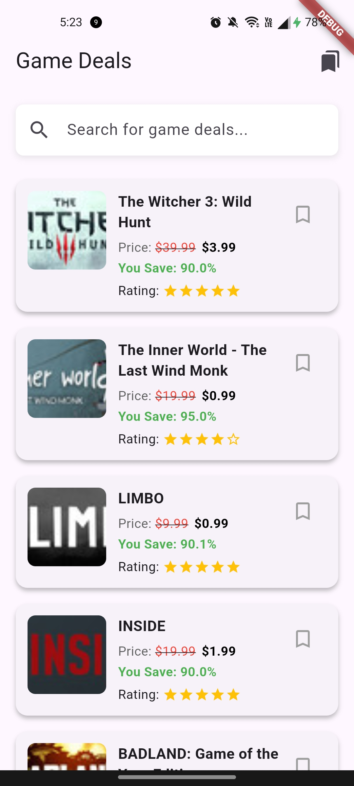

# Game Deals Mobile App

A Flutter application that helps users discover and save the best gaming deals.

<div align="center">
  
</div>

## App Structure

```
lib/
├── main.dart              # App entry point
├── models/                # Data models
│   ├── deal.dart          # Deal model
│   └── deal_adapter.dart  # Hive adapter for Deal
├── services/              # Services for data handling
│   ├── api_service.dart   # API requests
│   └── storage_service.dart # Local storage with Hive
├── viewmodels/            # Business logic
│   ├── home_viewmodel.dart      # Home screen logic
│   └── saved_deals_viewmodel.dart # Saved deals logic
└── views/                 # UI components
    ├── home_view.dart     # Main deals list
    ├── saved_deals_view.dart # Saved deals screen
    └── widgets/           # Reusable widgets
        ├── deal_card.dart # Card for displaying a deal
        └── search_bar.dart # Search functionality
```

## Features

- Browse latest game deals from multiple stores
- Search for specific games
- View details including price, discount percentage, and ratings
- Save favorite deals for later
- Real-time search functionality
- Pull-to-refresh to update deals

## Getting Started

### Prerequisites

- Flutter SDK 3.7.2 or higher
- Dart SDK 3.0.0 or higher

### Installation

1. Clone the repository:
```bash
git clone https://github.com/hsajid-cs/game-deal.git
cd game_deals
```

2. Install dependencies:
```bash
flutter pub get
```

3. Run the app:
```bash
flutter run
```

### Running Tests

To run all tests:
```bash
flutter test
```

To run a specific test file:
```bash
flutter test test/home_viewmodel_test.dart
```

To run tests with coverage report:
```bash
flutter test --coverage
```

## Architecture

This app follows the MVVM (Model-View-ViewModel) architecture:

- **Models**: Plain Dart classes representing data
- **Views**: Flutter widgets that display the UI
- **ViewModels**: Classes that contain business logic and maintain state

We use Provider for state management and dependency injection.

## Data Sources

- Game deals data is fetched from a public API
- Favorites are stored locally using Hive

## Dependencies

- [provider](https://pub.dev/packages/provider): State management
- [hive](https://pub.dev/packages/hive): Local storage
- [http](https://pub.dev/packages/http): API requests
- [path_provider](https://pub.dev/packages/path_provider): File system access
- [intl](https://pub.dev/packages/intl): Date formatting

## Testing

The app includes the following types of tests:
- Unit tests for ViewModels
- Widget tests for UI components
- Integration tests for key user flows
